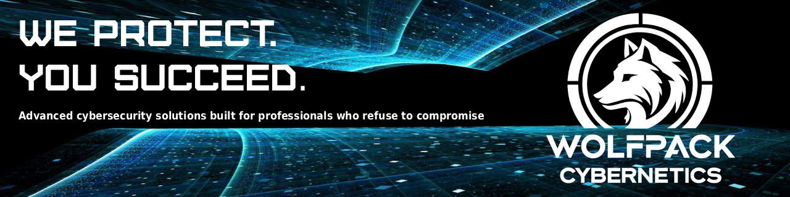

<!-- markdownlint-disable-next-line -->

  <!-- markdownlint-disable-next-line -->
  # WolfpackCybernetics

  
  
  

  

### Third-Party Assets
This project is built on the Jekyll ecosystem and some great libraries, and is developed using VS Code as well as tools provided by JetBrains under a non-commercial open-source software license.
